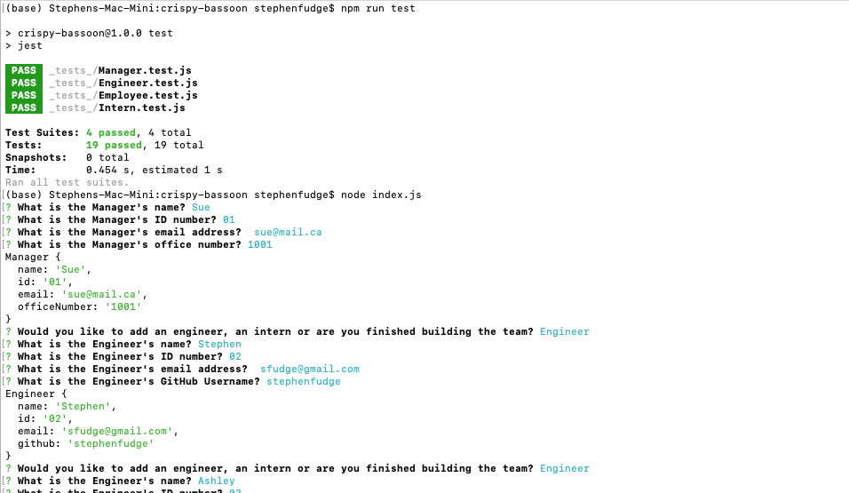

# crispy-bassoon

## Team Generator - Challenge Assignment 10 OOP

- *What was your motivation?*  I wanted to be able to create an HTML template for a team
- *Why did you build this project?*  To be able to run tests on using node/npm
- *What problem does it solve?*  It solves the problem of having to manually run tests on the script.
- *What did I learn?* I learned how run tests through the terminal. I also learned about classes and how to implement them and how to extend them as well.

## Installation

*What are the steps required to install your project? Provide a step-by-step description of how to get the development environment running.*

Download index.js, the package.json file, all the files in the lib folder, as well as the _tests_ folder then from your terminal run 'npm i' to install the packages associated with this project.

## Usage

*Provide instructions and examples for use. Include screenshots as needed.*

To run the testing suites, after you have downloaded the files above, you can run 'npm run tests" from terminal to run the appropriate tests.

To create the HTML Team File, once you have installed the associated packages, then from your terminal you will want to run 'node index.js' and answer the question prompts that appear.

Below is a screenshot of what the terminal should look like after the questions have appeared.  Within the dist folder there is also a created HTML file that was created using this project from terminal.

There is also a [Video Link](https://youtu.be/iQDll91LnE4)

## Credits
I used MDN for help with classes. I used https://www.npmjs.com/ for documentation on the packages so that I knew how to manipulate the data.  
I used bootstrap for the html page. 